# Análisis de Datos de Pingüinos para National Geographic

## Introducción

Este documento presenta un análisis detallado del conjunto de datos 'penguins' de la librería 'seaborn' en Python, con el objetivo de aplicar técnicas de reducción de dimensionalidad y agrupamiento. Se busca explorar las relaciones entre las características físicas de diferentes especies de pingüinos y entre las propias especies.

## Descripción del Conjunto de Datos

El conjunto de datos incluye información sobre varias especies de pingüinos, recopilada en diferentes islas, y abarca las siguientes características:

- `species`: Especie del pingüino.
- `island`: Isla de recopilación de datos.
- `bill length mm`: Longitud del pico.
- `bill depth mm`: Profundidad del pico.
- `flipper length mm`: Longitud de la aleta.
- `body mass g`: Masa corporal.
- `sex`: Género del pingüino.

## Apartados a Realizar

### Carga y Exploración del Dataset

#### Tareas Iniciales (0.5 puntos)

1. **Carga del Conjunto de Datos**
    Para cargar el conjunto de datos 'penguins' desde Seaborn, utilizamos el siguiente código:

    ```python
    import seaborn as sns

    # Cargando el conjunto de datos de Palmer Penguins
    penguins_data = sns.load_dataset("penguins")
    print(penguins_data.head())
    ```
    Esto nos da las primeras cinco filas del conjunto de datos para tener una primera impresión del tipo de datos con los que trabajaremos:

    ```bash
        species     island  bill_length_mm  bill_depth_mm  flipper_length_mm  body_mass_g     sex
    0  Adelie  Torgersen            39.1           18.7              181.0       3750.0    Male
    1  Adelie  Torgersen            39.5           17.4              186.0       3800.0  Female
    2  Adelie  Torgersen            40.3           18.0              195.0       3250.0  Female
    3  Adelie  Torgersen             NaN            NaN                NaN          NaN     NaN
    4  Adelie  Torgersen            36.7           19.3              193.0       3450.0  Female
    ```

2. **Estadísticas Descriptivas**

    En primer lugar, usando la librería `missingno` de python vamos a visualizar gráficmente los valores perdidos del dataset:

    

    Como vemos, los valores perdidos suelen darse en su mayoría en la columna "sex" del dataframe, o en algunas filas simultáneamente para "bill_length_mm" , "bill_depth_mm", "flipper_length_mm", "body_mass_g". Para conocer el número exacto de valores perdidos ejecutamos:

    ```python
    penguins_data.isna().sum()
    ```

    Obteniendo:

    ```bash
    species               0
    island                0
    bill_length_mm        2
    bill_depth_mm         2
    flipper_length_mm     2
    body_mass_g           2
    sex                  11
    ```
    Para limpiar estos valores perdidos vamos a proceder de la siguiente forma: 
    
    * Eliminamos las filas que simultáneamente tienen valores perdidos en "bill_length_mm" , "bill_depth_mm", "flipper_length_mm", "body_mass_g", pues solamente son dos filas y no supone una pérdida de datos relevante.
    * Imputamos el valor de sex con el siguiente método: Para cada fila con el valor sex como valor perdido, calculamos la distancia euclídea teniendo en cuenta "bill_length_mm" , "bill_depth_mm", "flipper_length_mm", "body_mass_g" a la media para los ejemplares "hembras" y "Machos". Si está más próximo a la media de los "Machos" se imputa como este valor, en caso contrario como "hembra". El código es el siguiente:

        ```python
        # Imputación del valor de 'sex'
        # Calcula las medias para machos y hembras
        means_male = penguins_data[penguins_data['sex'] == 'Male'][columnas_a_verificar].mean()
        means_female = penguins_data[penguins_data['sex'] == 'Female'][columnas_a_verificar].mean()

        # Función para calcular la distancia a las medias
        def impute_sex(row):
            if pd.isna(row['sex']):
                dist_to_male = euclidean(row[columnas_a_verificar], means_male)
                dist_to_female = euclidean(row[columnas_a_verificar], means_female)
                return 'Male' if dist_to_male < dist_to_female else 'Female'
            else:
                return row['sex']

        # Aplicar la función para imputar 'Sex'
        penguins_data['sex'] = penguins_data.apply(impute_sex, axis=1)
        ```
    Tras esto, se eliminan los valores perdidos del dataset:

    

    Por otro lado se calculan estadísticos para las columnas numéricas Obteniendo los siguientes resultados:

    ```bash
                        count         mean         std     min       25%      50%     75%     max  Datos Perdidos
    bill_length_mm     342.0    43.921930    5.459584    32.1    39.225    44.45    48.5    59.6               0
    bill_depth_mm      342.0    17.151170    1.974793    13.1    15.600    17.30    18.7    21.5               0
    flipper_length_mm  342.0   200.915205   14.061714   172.0   190.000   197.00   213.0   231.0               0
    body_mass_g        342.0  4201.754386  801.954536  2700.0  3550.000  4050.00  4750.0  6300.0               0
    ```

    Las estadísticas descriptivas del conjunto de datos 'penguins' muestran que:

    * La longitud del pico tiene una media de aproximadamente 43.92 mm y una variabilidad moderada.
    * La profundidad del pico es menos variable que la longitud y tiene una media de 17.15 mm.
    * La longitud de la aleta muestra una dispersión similar a la longitud del pico con una media de 200.91 mm.
    * La masa corporal de los pingüinos varía sustancialmente, con una media de 4201.75 g. Se presenta un posible valor atípico pues el máximo es de 6300.

3. **Gráficos de Dispersión y Visualizaciones Relevantes**

    La exploración gráfica del conjunto de datos de pingüinos, utilizando gráficos de dispersión y pairplots, proporciona información valiosa sobre la estructura y las relaciones en los datos:
  
    * **Gráfico de Dispersión de Longitud y Profundidad del Pico**
        
        Este gráfico muestra una clara separación entre las tres especies de pingüinos basándose en la longitud y la profundidad de sus picos. Los pingüinos Adelie tienden a tener picos más cortos y profundos, los Chinstrap tienen picos más largos y menos profundos, y los Gentoo se distinguen por tener los picos más largos y menos profundos de los tres. Esta distinción sugiere que la longitud y la profundidad del pico podrían ser buenos predictores para la clasificación de las especies.

    * **Pairplot de Características Físicas**
        

        El pairplot muestra las distribuciones y correlaciones entre la longitud del pico, la profundidad del pico, la longitud de la aleta y la masa corporal. Se observa que los Gentoo, en general, tienen las aletas más largas y la mayor masa corporal, mientras que los Adelie son más pequeños en ambos aspectos. Los Chinstrap se ubican en un rango intermedio en la mayoría de las características. La masa corporal parece aumentar con la longitud de la aleta, lo que indica una posible correlación entre estas dos variables.

    Ambos gráficos destacan diferencias morfológicas significativas entre las especies, lo que puede reflejar adaptaciones a diferentes nichos ecológicos. Estas visualizaciones también sugieren que las medidas morfológicas de los pingüinos son multidimensionales y que la variación dentro de cada especie es considerable, lo que justifica un análisis más profundo para comprender las dinámicas de la población y la adaptación de las especies.


### Reducción de Dimensionalidad

#### Análisis de Componentes Principales (ACP) (1.5 puntos)

1. **Matriz de Correlaciones y Representación Gráfica (0.5 pts)**
    En primer lugar vamos a calcular la matriz de correlaciones y representarla gráficamente, para ello empleamos el siguiente código: 

    ```python
    # Matriz de correlaciones 
        matriz_correlaciones = penguins_data.corr(numeric_only=True)

        # Crear una máscara para la matriz triangular superior
        mask = np.triu(np.ones_like(matriz_correlaciones, dtype=bool))
        matriz_correlaciones[mask] = np.nan

        # Crear un mapa de calor para la matriz de correlación
        plt.figure(figsize=(10, 8))
        sns.heatmap(matriz_correlaciones, annot=True, cmap='coolwarm')
        plt.title("Matriz de correlacion Pinguinos")
        plt.show()
    ``` 
    Obteniendo la siguiente matriz de correlaciones:

    

    La matriz de correlación proporcionada muestra las siguientes correlaciones entre las medidas físicas de los pingüinos:

    * **Correlación Directa más Fuerte (positiva)**: Entre la longitud de la aleta (flipper_length_mm) y la masa corporal (body_mass_g) con un coeficiente de 0.87. Esto indica que los pingüinos con aletas más largas tienden a tener una masa corporal mayor, lo cual indica una relación lógica entre el tamaño del pingüino y su peso.

    * **Correlación Inversa más Fuerte (negativa)**: Entre la longitud de la aleta (flipper_length_mm) y la profundidad del pico (bill_depth_mm) con un coeficiente de -0.58. Esto sugiere que los pingüinos con aletas más largas tienden a tener picos menos profundos, lo que podría reflejar adaptaciones específicas entre diferentes especies o dentro de una población en respuesta a sus hábitats y estilos de alimentación.

    Estas correlaciones pueden tener implicaciones ecológicas y evolutivas significativas, ya que las diferentes medidas pueden estar relacionadas con estrategias de alimentación, hábitats preferidos y otras presiones de selección ambiental.

2. **PCA con Datos Estandarizados (1 pt)**

    **Cálculo de componentes y análisis de autovalores:**
    Los autovalores obtenidos de un PCA proporcionan una medida de la variabilidad que cada componente principal captura del conjunto de datos.
    En este caso, los autovalores y la variabilidad explicada por cada componente son:

    * *Componente 1*: Autovalor de 2.761831, explicando el 68.843878% de la variabilidad.
    * *Componente 2*: Autovalor de 0.774782, explicando el 19.312919% de la variabilidad.
    * *Componente 3*: Autovalor de 0.366307, explicando el 9.130898% de la variabilidad.
    * *Componente 4*: Autovalor de 0.108810, explicando el 2.712305% de la variabilidad.

    Estos valores sugieren que el primer componente principal captura la mayoría de la variabilidad, seguido por el segundo componente. Los componentes 3 y 4 contribuyen significativamente menos a la explicación de la variabilidad en los datos.

    **Gráficas resumen y decisión sobre el número de componentes:**

    
    En la gráfica obtenida se aprecia un fuerte "codo" después del segundo componente principal, lo que indica que la inclusión de más componentes no añade mucha información. La variabilidad acumulada hasta el segundo componente es del 88.156797%, lo que significa que estos dos componentes juntos capturan la gran mayoría de la información en el conjunto de datos.

    **Decisión sobre el número de componentes:**
    En la práctica, una regla común es elegir el número de componentes que suman una variabilidad acumulada cercana al 70-90%. Dado que los dos primeros componentes explican aproximadamente el 88% de la variabilidad, es razonable seleccionar solo estos dos para una representación eficiente de los datos. Esto reduce la dimensionalidad del conjunto de datos mientras se retiene la mayoría de la información, lo que facilita la visualización y el análisis subsiguiente de los datos.

    Por lo tanto, se recomienda utilizar dos componentes principales para representar este conjunto de datos de pingüinos.

#### Interpretación de Componentes Principales (2 pts)

1. **Representación Gráfica de Variables en Componentes**

    

    La representación gráfica de las variables en los componentes principales, conocida como biplot, permite observar cómo cada variable contribuye a los componentes. Las imágenes que muestran las contribuciones proporcionales y los cuadrados de las cargas en las componentes principales revelan la importancia relativa de cada medida física en los componentes seleccionados.

    * *Componente 1*: Este componente captura la mayor varianza y parece estar fuertemente influenciado por todas las variables físicas, como la longitud de la aleta y la masa corporal, lo que sugiere que puede representar el tamaño general o la 'corpulencia' de los pingüinos.

    * *Componente 2*: El segundo componente, aunque captura menos varianza que el primero, parece estar más relacionado con la longitud del pico y la profundidad del pico, lo que podría reflejar adaptaciones específicas relacionadas con el comportamiento alimenticio de los pingüinos o diferencias entre las especies.
    
2. **Representación de Observaciones en Nuevos Ejes**
    

    

    Las especies de pingüinos que se destacan en cada componente se pueden inferir de la posición de las observaciones en el gráfico de dispersión de PCA.

    * Las observaciones que tienen valores altos en la Primera Componente Principal son aquellos pingüinos que son grandes en términos de masa corporal y tamaño del pico.

    * Las observaciones que tienen valores altos o bajos en la Segunda Componente Principal son aquellos pingüinos que tienen características distintivas de pico y aletas que no están directamente relacionadas con el tamaño general. Por ejemplo, una aleta más larga o un pico más profundo en relación con su masa corporal.

3. **Construcción de un Índice para Características Físicas**
    La construcción de un índice compuesto para representar las características físicas de los pingüinos puede proporcionar una única medida descriptiva que resuma las variables más significativas. Utilizando los componentes principales, podemos desarrollar un índice que capture la esencia de la variabilidad física de los pingüinos.

    El **índice de características físicas (ICF)** podría definirse como una combinación lineal de las variables estandarizadas, ponderadas por su contribución al primer componente principal, que es el que más varianza explica. Este índice se calcularía de la siguiente manera para cada pingüino:

    ```plaintext
    ICF = (carga_1 * bill_length_mm_z) + (carga_2 * bill_depth_mm_z) + 
        (carga_3 * flipper_length_mm_z) + (carga_4 * body_mass_g_z)
    ```

    Donde carga_n es la carga de la variable en el Componente Principal 1 y variable_z es el valor estandarizado de dicha variable.

    Para evaluar el índice de cada especie, calcularíamos el promedio del ICF para todas las observaciones de cada especie. Esto nos daría una puntuación única que reflejaría las tendencias generales en las características físicas para las especies Adelie, Chinstrap y Gentoo. Los valores altos del índice indicarían pingüinos con características físicas que corresponden positivamente con el primer componente principal, mientras que los valores bajos indicarían lo contrario.

    Este índice podría tener aplicaciones prácticas, por ejemplo, en estudios de conservación para monitorear la salud y el bienestar de las poblaciones de pingüinos en relación con sus hábitats y disponibilidad de recursos.

    Este enfoque proporciona una herramienta simplificada para analizar y comparar las características físicas de las diferentes especies de pingüinos, lo cual es particularmente útil cuando se manejan múltiples variables y se desea tener una visión integrada del fenotipo de los organismos estudiados.

### Técnicas de Agrupamiento (Clustering)

#### Determinación del Número de Grupos (1 pt)

1. **Agrupamiento Jerárquico y Dendrograma**

    En primer lugar vamos a visualizar en un mapa de calor el dataset que estamos estudiando y vamos a ver el clustermap que sugiere `seaborn`:

    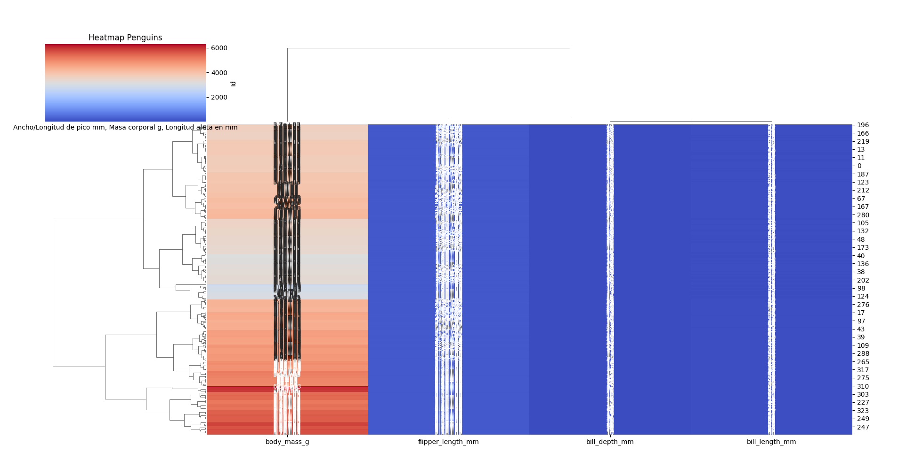

    Tras esto procedemos a realizar la matriz de distancias sin estandarizar los datos y estandarizándolos para ver las diferencias:

    
    

    Realizamos el clustering jerárquico sobre la matriz de distancias: 

    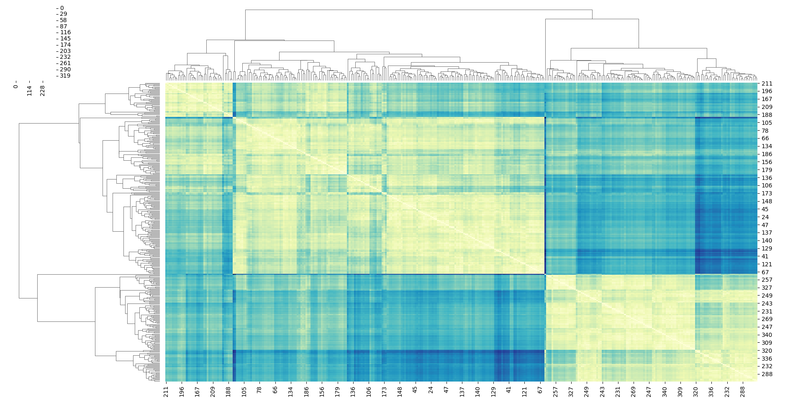

    Calculamos el dendograma:

    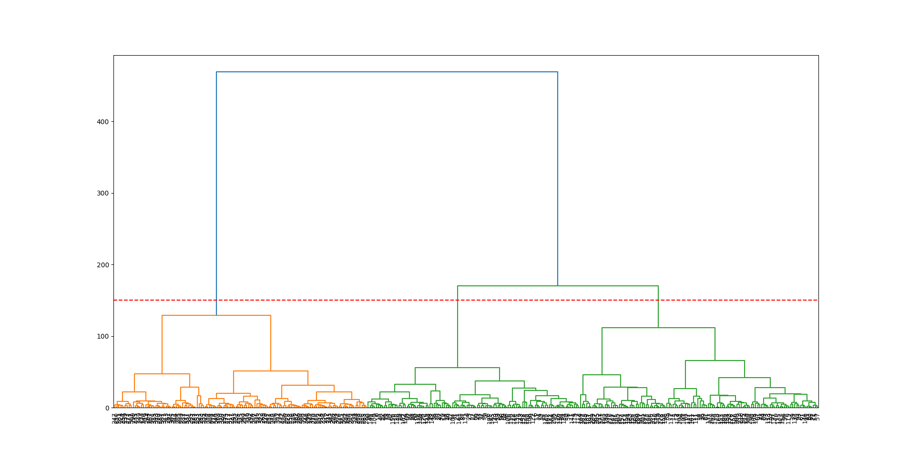

    Atendiendo a los resultados, parece que 2 clusters son un número razonable, pues como vemos, para la recta y=300, cortamos en dos puntos indicando 2 clusters y se puede apreciar que la distancia de estos dos segmentos es considerablemente grande antes de unirse en un único cluster, lo que sugiere que 2 es una buena elección de clusters para este dataset. Esta elección minimiza la varianza intra-cluster y maximiza la varianza inter-cluster, lo que significa que los datos dentro de cada cluster son lo más similares posible entre sí, mientras que los datos entre diferentes clusters son lo más diferentes posible. Vamos a asignar cada observación a su cluster correspondiente: 

    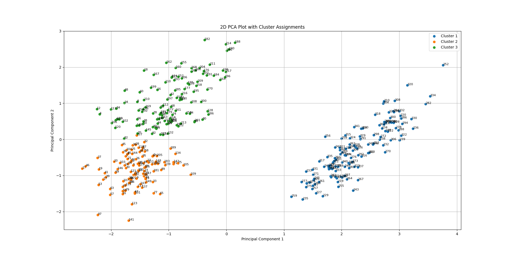

    Cómo se puede apreciar en el gráfico, se ven claramente dos grupos, por lo que parece una asignación correcta.
    
#### Agrupamiento K-Means (1 pt)

1. **Implementación y Experimentación con K-Means**

    En base al estudio previo se ha optado por realizar el algoritmo con 2 grupos:

    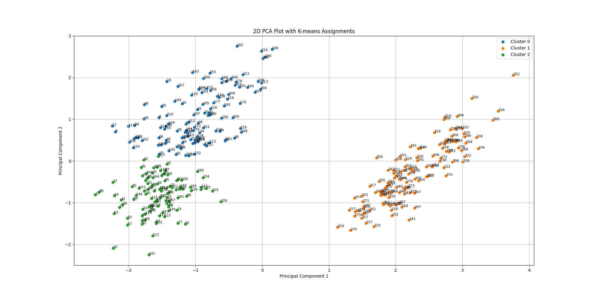

    Como vemos, obtenemos un resultado idéntico al del clustering jerárquico, debido a que los dos grupos están muy claramente diferenciados.

    Vamos ahora a suponer que no hemos realizado el clustering jerárquico y vamos a elegir el número de grupos en base al método del codo y Shilouette. Los resultados obtenidos son los siguientes: 

    
    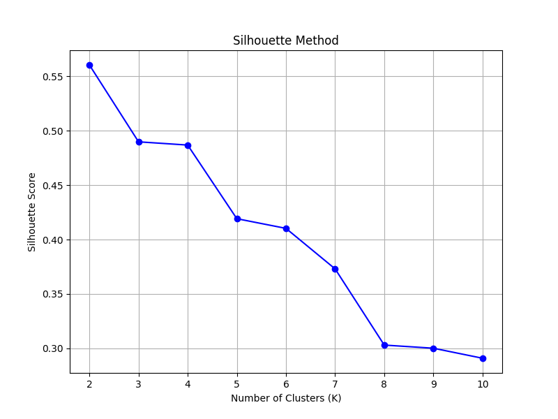

    
    En la gráfica del método del codo, parece que el codo se produce alrededor de k=3, donde la tasa de disminución de WCSS cambia notablemente de ser muy empinada a más moderada. Sin embargo, en la gráfica del método de Silhouette una puntuación alta indica que los objetos están bien emparejados a su propio cluster y mal emparejados a los clusters vecinos. En tu gráfica, el valor más alto de la puntuación de la silueta ocurre en k=2.

    Dado que en este ejercicio hemos decidido dar más peso a tener dos clusters bien diferenciados más que a capturar la variabilidad de los datos, vamos a inclinarnos por tomar 2 clusters para resolver el ejercicio. Con esto obtendríamos la misma gráfica que al comienzo.


#### Validación del Agrupamiento (1 pt)

1. **Métricas de Validación de Agrupamiento**
   
   Evaluamos la calidad del agrupamiento usando los coeficientes de Silhouette:

   

    * **Valores del Coeficiente de Silueta:** El coeficiente de silueta varía de -1 a +1. Un valor alto indica que el objeto está bien emparejado con su propio cluster y mal emparejado con los clusters vecinos. Si la mayoría de los puntos tienen un valor alto, entonces la configuración de clustering es apropiada. En la imagen, parece que la mayoría de los valores de silueta están por encima de cero, lo cual es una buena señal.

    * **Ancho del Gráfico de Silueta:** El ancho del gráfico de silueta mide la distancia al cluster vecino más cercano. Un gráfico de silueta más ancho sugiere que los clusters están bien separados.

    * **Clusters (0 y 1):** Hay dos clusters representados por dos colores diferentes (digamos, naranja y púrpura). No se observan valores negativos significativos en el gráfico de silueta, lo que generalmente indicaría que los puntos podrían haber sido asignados a clusters incorrectos.

    * **Tamaño de los Clusters:** El gráfico sugiere que el tamaño de los dos clusters es desigual. El cluster etiquetado como '0' parece ser más grande que el cluster '1', lo que indica que contiene más puntos. Esto no es necesariamente malo, ya que los algoritmos de agrupamiento no requieren que los clusters tengan tamaños iguales.

    * **Consistencia en los Clusters:** El cluster naranja parece tener una consistencia de anchura en sus valores de silueta, lo que sugiere que los puntos dentro de este cluster son bastante similares entre sí. Por otro lado, el cluster púrpura tiene una mayor variación en la anchura, lo que puede indicar que hay más variabilidad en la similitud de los puntos dentro de ese cluster.

    La información proporcionada sugiere que el algoritmo de agrupamiento ha funcionado bien en este aspecto, logrando captar la estructura interna inherente a los datos y encontrando un modo de separarlos en dos clusters bien diferenciados.

#### Comparación de Métodos de Agrupamiento (1 pt)

1. **Jerárquico vs. K-Means**
    Como los resultados obtenidos por ambos métodos son idénticos, pues hemos elegido el mismo número de clusters y hemos obtenido la misma asignación de cada observación a los clusters, vamos a ver las diferencias entre esto métodos desde el punto de vista de las características de cada algoritmo y de la interpretación de los resultados:

    ##### Características de los Algoritmos
    - KMeans generalmente tiene una complejidad temporal más baja que el clustering jerárquico, especialmente para grandes conjuntos de datos. KMeans tiene una complejidad de `O(n)`, donde `n` es el número de datos, mientras que el clustering jerárquico tiene una complejidad de `O(n^2)` en su forma más básica. Por este motivo, si hubiésemos trabajado con una submuestra representativa de un dataset más amplio y fuese importante el ahorro computacional, sería mejor apostar por la alternativa de KMeans.

    - KMeans puede dar diferentes resultados en diferentes ejecuciones si se inicializan diferentes centroides (no es determinista), a menos que se utilice una semilla aleatoria fija. Por otro lado, el clustering jerárquico es determinista, dando siempre el mismo resultado para un conjunto de datos dado. Por lo tanto, a menos que usemos siempre la misma semilla y los datos no tuvieran una separación clara, el algoritmo KMeans no tendría por qué darnos la misma solución siempre.

    - Los dendrogramas del clustering jerárquico ofrecen una visualización detallada y una interpretación intuitiva de la estructura de los datos y las relaciones entre clusters. KMeans no ofrece una visualización tan rica inherentemente, aunque se pueden utilizar técnicas como el análisis de componentes principales (PCA) para visualizar los clusters tal y cómo se ha hecho en esta práctica. No obstante, para un conjunto de datos mayor, lejos de ser claro, el dendograma obtenido podría ser lioso y complicar la interpretación de lo que está sucediendo.


#### Interpretación de los Grupos (1 pt)

1. **Análisis de los Grupos Identificados**

    Si representamos el gráfico de dispersión coloreando las observaciones según la especie, encontramos lo siguiente:

    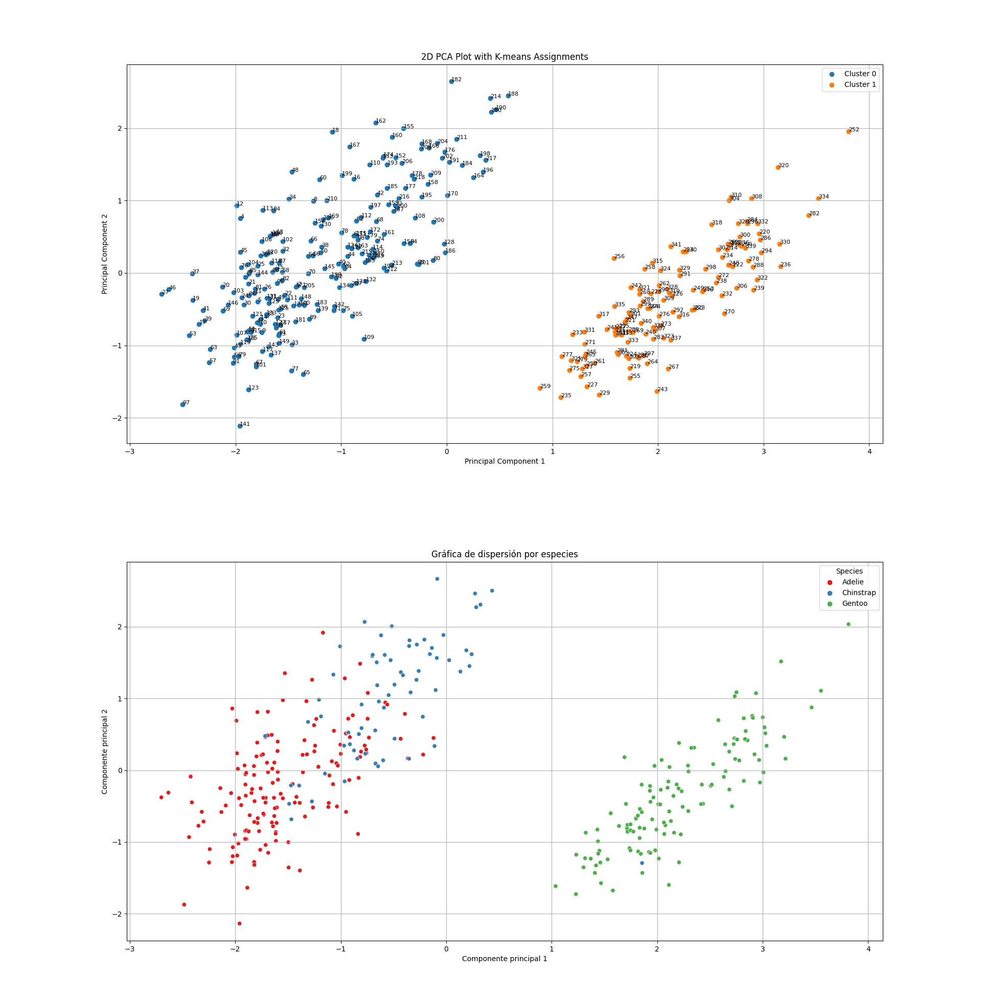

    Se puede observar cómo con la técnica de PCA se consigue separar claramente las especies "Adelie" y "Chinstrap" de la especie "Gentoo" de pingüinos, por otro lado, vemos como después de aplicar el algoritmo KMeans (y ocurre igual con el algoritmo jerárquico), si representamos los grupos tras aplicar PCA, vemos como un cluster engloba todas las observaciones del grupo de pingüinos "Gentoo" y el otro cluster engloba todos los ejemplares de las especies "Adelie" y "Chinstrap". Esto sugiere que los algoritmos de Clustering están consiguiendo extraer adecuadamente las diferencias físicas subyacentes a cada especie de pingüinos siendo capaces de diferenciarlos en los dos grandes conjuntos y que después por medio de la técnica PCA se hace esta separación mucho más palpable. De hecho, si probamos a usar 3 clusters con el algoritmo Kmeans y el jerárquico, se obtendría lo siguiente:

    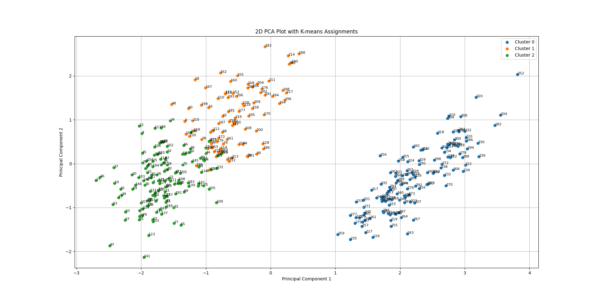
    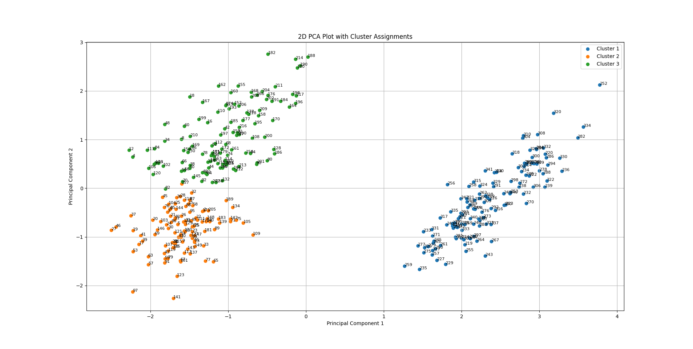

    Que coincide casi exactamente con la distribución de las 3 especies de pingüinos. De aquí podemos concluir pues, que estos algoritmos de clusterización, en base a las características numéricas del dataset, están siendo capaces de separar los pingüinos según su especie. De hecho si representamos los datos atendiendo al sexo o a la isla de procedencia, vemos como los datos no están separados atendiendo a estas características.

    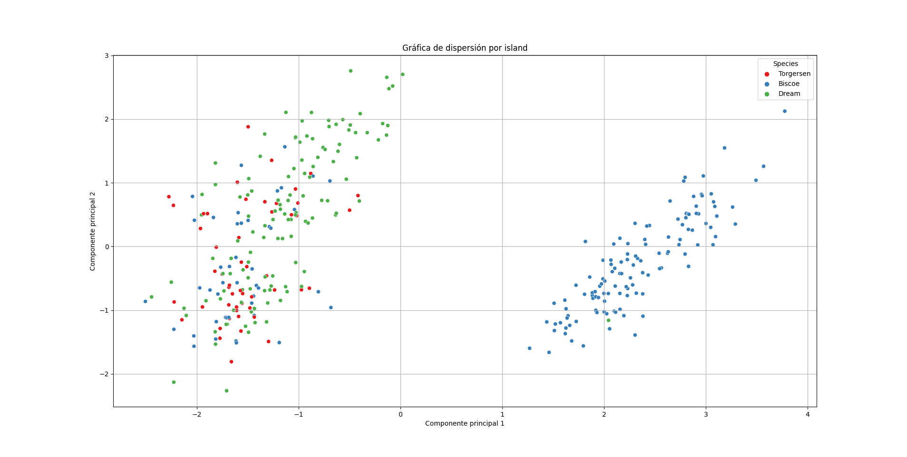
    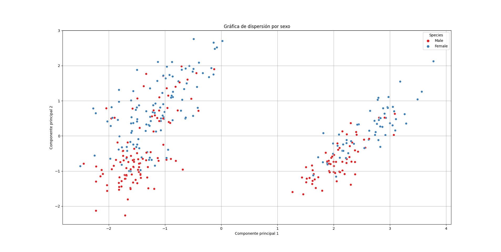

    Para el sexo vemos Como los datos están mezclados en los dos conjuntos diferenciados, y para el caso de la isla vemos que en conjunto de la derecha predominan los ejemplares de la isla "Biscoe", pero hay ejemplares de esta isla también en el otro conjunto.

    Recordamos que la varianza explicada por estas dos componentes principales es del 88% aproximadamente, que da una base sólida a este análisis.

### Resumen de hallazgos y conclusión

#### Resumen de hallazgos

* **Reducción de Dimensionalidad:** El análisis de componentes principales (PCA) fue capaz de reducir la dimensionalidad del conjunto de datos, concentrando la variabilidad significativa en **dos componentes principales** que explican aproximadamente el **88% de la variabilidad total**. Esto sugiere que la mayoría de las diferencias entre las observaciones se deben a estas dos dimensiones sintéticas.

* **Diferenciación de Especies:** Se identificaron **claras distinciones** entre las especies de pingüinos "Adelie" y "Chinstrap" frente a la especie "Gentoo". Estas diferencias se manifestaron tanto en la visualización de PCA como en los resultados de los algoritmos de clustering jerárquico y KMeans.

* **Comparación de Métodos de Clustering:** A pesar de que tanto el clustering jerárquico como el KMeans sugirieron dos clusters principales (atendiendo a los coeficientes de silueta), el análisis jerárquico proporcionó una visión más rica y detallada de la estructura de los datos gracias a la visualización del dendrograma.

* **Validación de Agrupamientos:** Los coeficientes de silueta indicaron que los clusters formados eran coherentes y bien definidos, lo que implica que las asignaciones de los pingüinos a los clusters fueron estadísticamente significativas.

* **Atributos no Diferenciadores:** Se observó que otros atributos como el sexo y la isla de origen no ofrecían una separación clara en el contexto de los clusters identificados, lo que sugiere que las variables numéricas de este dataset no aportan diferencias significativas en este sentido.

#### Conclusiones

El análisis confirma que las técnicas de reducción de dimensionalidad y clustering pueden ser herramientas poderosas para entender complejos conjuntos de datos. En el contexto del dataset de "penguins" de `seaborn`, los algoritmos de clustering aplicados son eficientes en la identificación de grupos naturales dentro del conjunto de datos de pingüinos, permitiendo una diferenciación clara que coincide con las especies biológicas representadas en el dataset.

Para comprender el interés de los resultados obtenidos, cabe resaltar que la capacidad de separar las especies de pingüinos basándose en características morfológicas tiene aplicaciones prácticas en ecología y conservación, y puede ayudar a los biólogos a entender mejor las adaptaciones físicas de estas especies a sus entornos. Por ejemplo, las diferencias en la longitud del pico y la profundidad pueden estar relacionadas con diferentes dietas y comportamientos alimenticios, mientras que las diferencias en la longitud de la aleta y la masa corporal podrían estar asociadas con la capacidad de natación y el aislamiento térmico.

Este estudio también resalta la importancia de utilizar múltiples técnicas y enfoques para validar los resultados. Aunque la elección del número de clusters puede ser algo subjetiva, la combinación de métodos jerárquicos, KMeans y métricas de validación como el coeficiente de silueta proporciona una base sólida para las decisiones analíticas.

En resumen, los resultados del análisis son robustos y proporcionan una base de conocimiento ampliable para futuras investigaciones sobre las especies de pingüinos y sus características físicas. Con estos hallazgos, National Geographic podría informar y educar al público sobre la diversidad y adaptación de las especies de pingüinos, así como sobre las técnicas de análisis de datos que permiten tales descubrimientos.